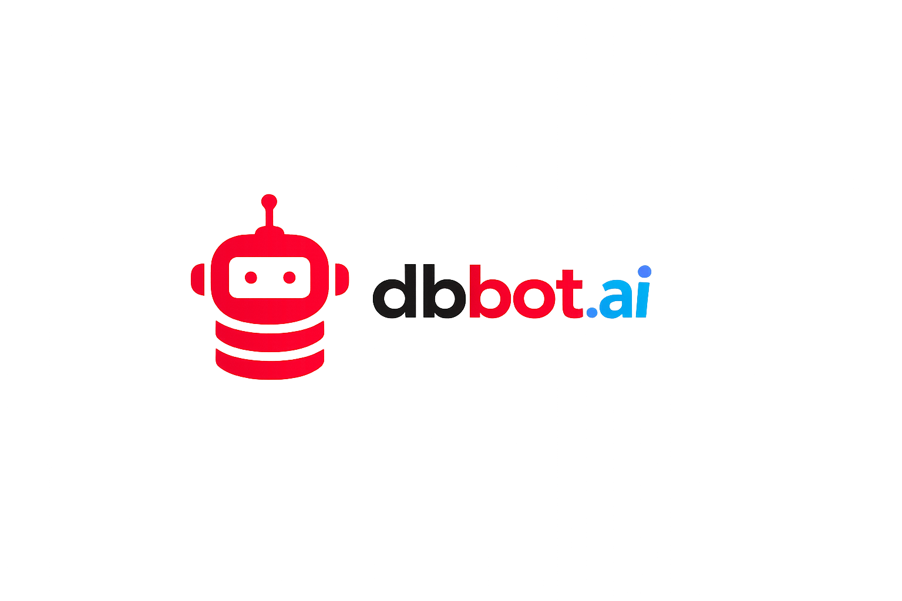

[English](./README.en.md)

<p align="center">
  
</p>

# dbbot

> MySQL OPS, PRODUCTIZED

`dbbot` 是一套面向 MySQL 生态的数据库自动化交付仓库，用来把部署、复制、备份、恢复、监控和下游分析接入沉淀成稳定、可重复、可审计的执行能力。当前仓库以 Ansible Playbook 为核心，覆盖 MySQL、ClickHouse 与 Prometheus/Grafana 相关场景，并作为后续 skills 与 AI agent 演进的执行底座。

## 官网与文档

- 官方网站：https://dbbot.ai
- 在线文档：https://dbbot.ai/docs/
- GitHub 仓库：https://github.com/fanderchan/dbbot
- Releases：https://github.com/fanderchan/dbbot/releases
- Issues：https://github.com/fanderchan/dbbot/issues

## 仓库包含什么

- `mysql_ansible`：MySQL / Percona / GreatSQL 部署、复制、备份、恢复与常见运维剧本。
- `clickhouse_ansible`：ClickHouse 集群部署、备份、恢复与下游分析接入相关剧本。
- `monitoring_prometheus_ansible`：Prometheus、Grafana、Alertmanager 与 exporter 相关剧本。
- `portable-ansible`：绿色版 Ansible 运行时，方便在目标环境中直接执行剧本。
- `bin/dbbotctl`：根仓级生命周期 CLI，用于环境自检、绿色版 Ansible 初始化、release 升级与回滚。

## 项目定位

- 标准化执行：先把确定性动作固化成剧本，再降低环境差异和手工操作带来的波动。
- 单仓交付：MySQL、ClickHouse 和监控能力按同一版本节奏发布，便于追踪与验收。
- 面向下一阶段：当前先把底层执行面打磨稳定，后续再把高频动作沉淀为 skills，并接入 AI agent。

## 推荐理解方式

`dbbot` 不是一堆分散脚本的集合，而是一套围绕数据库交付与运维场景组织的统一执行面：

- `mysql_ansible` 负责核心 OLTP 交付。
- `clickhouse_ansible` 负责下游 OLAP 场景。
- `monitoring_prometheus_ansible` 负责监控接入。
- `portable-ansible` 提供统一运行环境。

## 绿色版 Ansible 说明

- 仓库内置的绿色版运行时当前基于 `ansible-base 2.10.17`。
- 该运行时现在由 [`make_ansible_portable`](https://github.com/fanderchan/make_ansible_portable) 构建，不再直接依赖上游 `ownport/portable-ansible` 成品包。
- 运行时目录是 `portable-ansible/`；控制机初始化脚本与 `sshpass-x64` 已迁移到 `libexec/dbbotctl/`。

当前构建命令如下：

```bash
./build.sh \
  --python /usr/bin/python3 \
  --source ansible-base==2.10.17 \
  --without-vault \
  --without-yaml-c-extension \
  --clean-output \
  --extra-collection 'ansible.posix:==1.5.4'
```

参数含义：

- `--python /usr/bin/python3`：指定构建和自测时使用的控制机 Python。
- `--source ansible-base==2.10.17`：选择 `2.10` 代 Ansible 对应的官方 `ansible-base` 包版本。
- `--without-vault`：移除 `ansible-vault` 入口以及 `cryptography` / `cffi` 依赖链，减小体积；构建结果不再支持 vault。
- `--without-yaml-c-extension`：移除 `PyYAML` 的 C 扩展，回退到纯 Python YAML 实现。
- `--clean-output`：构建前清理同名旧产物。
- `--extra-collection 'ansible.posix:==1.5.4'`：把固定版本的 `ansible.posix` collection 直接打进 bundle，避免运行时再临时安装。

如果你只使用其中一个子目录，也建议按完整发版包部署，避免子目录版本与文档不一致。

## License

除另有说明外，本仓原创代码采用 `Apache-2.0`。

第三方组件与导入资产保留各自上游许可证，不并入仓库默认许可证。详情见：

- [LICENSE](./LICENSE)
- [NOTICE](./NOTICE)
- [THIRD_PARTY_LICENSES.txt](./THIRD_PARTY_LICENSES.txt)
